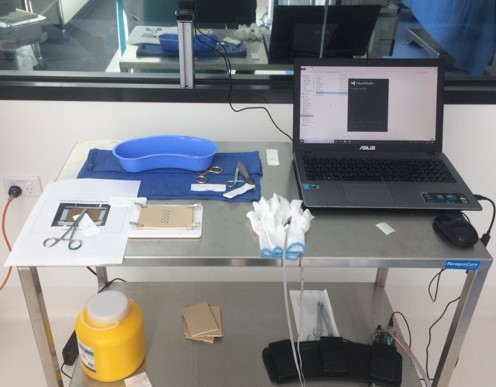

# stnn

Classify the skill expertise with motion signals.

Data collection for open surgery can be reproduced using readCOMport folder code and IMUarduino.h
One 9=DOF IMU sensor was sewed on a glove. Users were asked to wear the glove and implement core surgical skills. Their implements were recorded and save into a PC.

Other dataset, JIGSAWS dataset (a RMIS dataset) can be download at https://cirl.lcsr.jhu.edu/research/hmm/datasets/jigsaws_release/
or take a data sample from here: https://drive.google.com/drive/folders/1cN-UQgy0Z1tNrQL7xTDtTi0ynBGGZC10?usp=sharing

Setup:

...
